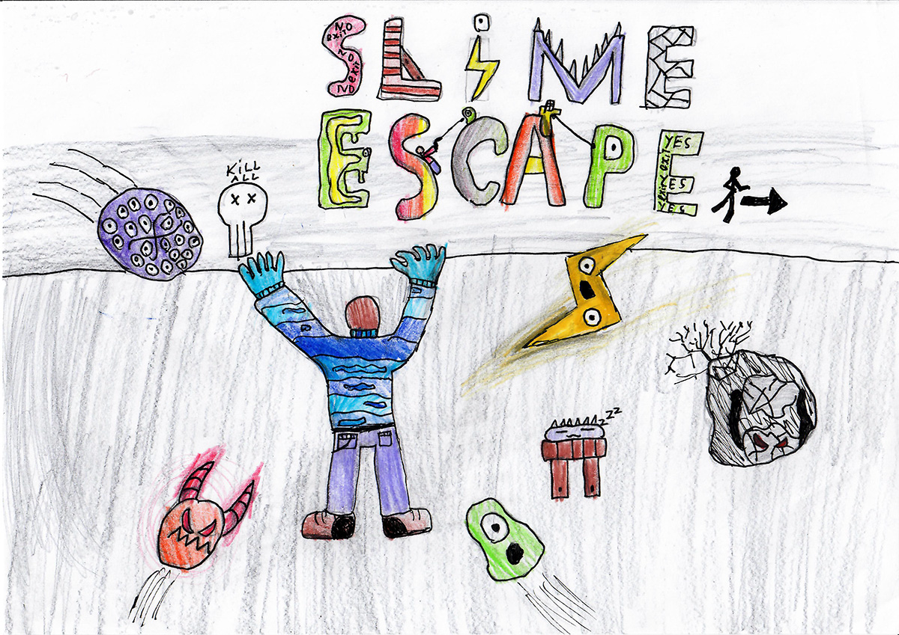
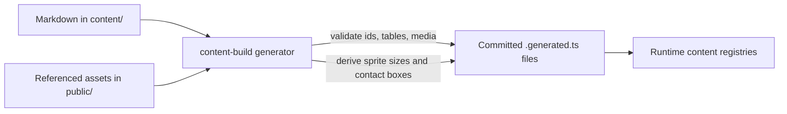

# Slime Escape

Escape the slime nightmare: survive the waves while the darkness closes in, use the short breaks when it pulls back, and defeat the one who trapped you in this world.



## Documentation

- [docs](docs) — game design and product documents
- [design](design) — engineering decisions
- [stories](stories) — stories and vertical slices
- [content](content) — content data: enemies, bosses, weapons, drops, players, sessions
- [mockups](mockups) — UI mockups and visual references

## Content Pipeline

Game data from [content](content) is compiled into committed `.generated.ts` files before the app runs.

### How It Works



- Markdown describes archetypes and session presets with H1/H2 sections and GFM tables.
- Referenced media is checked against files under `public/**`.
- Asset-derived values, such as sprite sizes and contact boxes, stay out of Markdown and are recomputed by the generator.
- Generated files live next to the code that consumes them; handwritten neighbours own public types, registries, and runtime validation.
- Writes are atomic: if parsing or validation fails, existing generated files are left unchanged.

### Content Edits

1. Change Markdown or referenced assets.
2. Run `npm run content:build`.
3. Review and commit both authored sources and generated files.

`npm run dev` already regenerates content through `predev`. Production builds run `content:check` to catch generated-file drift without rewriting files.

## Running

Requires Node.js 22+ and npm 11+.

```bash
npm install
npm run dev      # Vite dev server at http://127.0.0.1:5173
npm run build    # production build into dist/
npm run preview  # local preview server for the built bundle
npm run typecheck
```

## Credits

Game design by Wertakull.

---

© 2026 Wertakull
