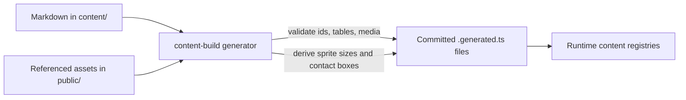

# Content

Game data from this directory is compiled into committed `.generated.ts` files before the app runs.

## Files

- [enemies.md](enemies.md) - enemy archetypes and shared slime resources
- [bosses.md](bosses.md) - boss archetypes
- [weapons.md](weapons.md) - weapon archetypes
- [drops.md](drops.md) - drop archetypes
- [players.md](players.md) - player presets
- [sessions](sessions) - playable sessions and mode presets

## Content Pipeline

- Markdown describes archetypes and session presets with H1/H2 sections and GFM tables.
- Referenced media is checked against files under `public/**`.
- Asset-derived values, such as sprite sizes and contact boxes, stay out of Markdown and are recomputed by the generator.
- Generated files live next to the code that consumes them; handwritten neighbours own public types, registries, and runtime validation.
- Writes are atomic: if parsing or validation fails, existing generated files are left unchanged.

## Content Edits

1. Change Markdown or referenced assets.
2. Run `npm run content:build`.
3. Review and commit both authored sources and generated files.

`npm run dev` already regenerates content through `predev`. Production builds run `content:check` to catch generated-file drift without rewriting files.

---

© 2026 Wertakull
