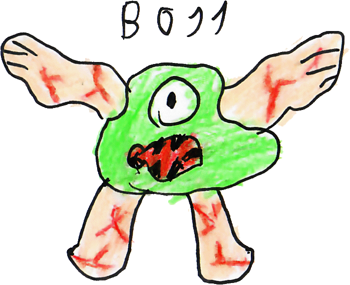
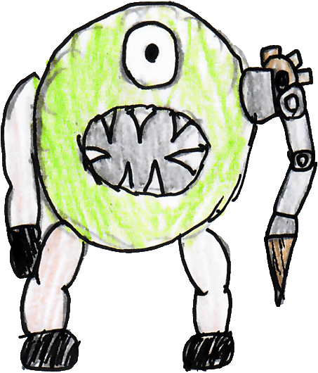
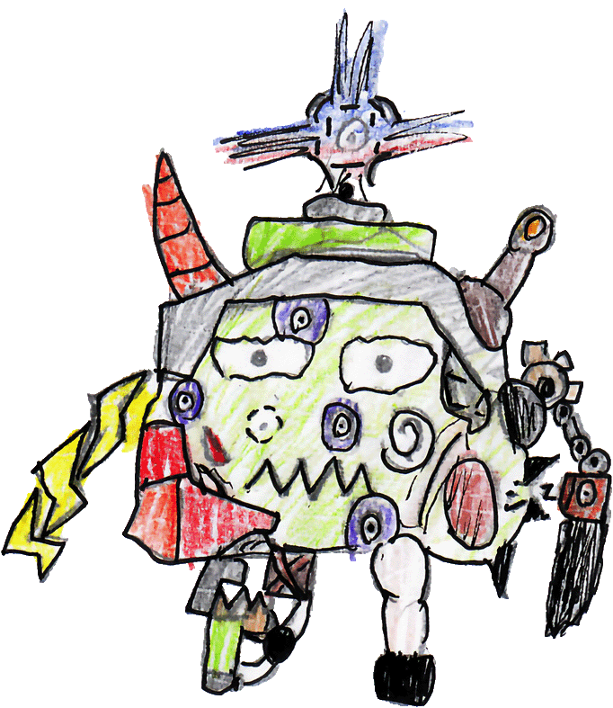
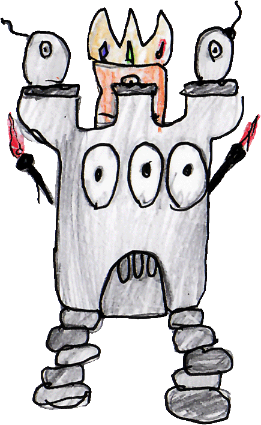
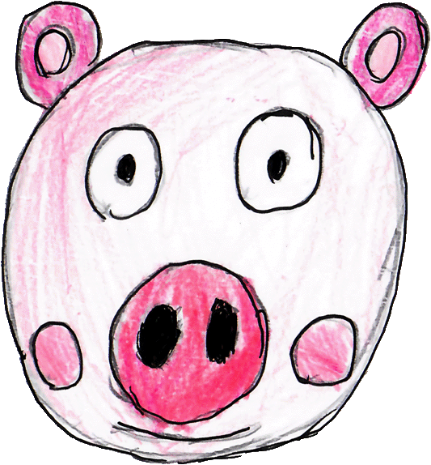

# Bosses

## boss-gargoyle

| field | value |
|---|---|
| displayName | Gargoyle Slime |
| color | #aa44ff |

## boss-saw-cyclops

| field | value |
|---|---|
| displayName | Saw Cyclops |
| color | #aa44ff |

## boss-scrap-king

| field | value |
|---|---|
| displayName | Scrap King |
| color | #aa44ff |

## boss-tower-sentinel

| field | value |
|---|---|
| displayName | Tower Sentinel |
| color | #aa44ff |

## boss-bubble-hog

| field | value |
|---|---|
| displayName | Bubble Hog |
| color | #aa44ff |

# Balance

## Body

| id | radius | maxHp |
|---|---:|---:|
| boss-gargoyle | 1.15 | 35 |
| boss-saw-cyclops | 1.25 | 45 |
| boss-scrap-king | 1.35 | 40 |
| boss-tower-sentinel | 1.30 | 50 |
| boss-bubble-hog | 1.20 | 42 |

## Movement

| id | maxSpeed |
|---|---:|
| boss-gargoyle | 3.2 |
| boss-saw-cyclops | 2.4 |
| boss-scrap-king | 3.0 |
| boss-tower-sentinel | 1.8 |
| boss-bubble-hog | 2.6 |

## Contact damage

| id | contactDamage | contactCooldownMs |
|---|---:|---:|
| boss-gargoyle | 2 | 800 |
| boss-saw-cyclops | 3 | 900 |
| boss-scrap-king | 2 | 800 |
| boss-tower-sentinel | 3 | 1000 |
| boss-bubble-hog | 2 | 850 |

## Knockback

| id | baseImpulse | velocityScale | durationMs |
|---|---:|---:|---:|
| boss-gargoyle | 5 | 0.4 | 220 |
| boss-saw-cyclops | 5 | 0.4 | 220 |
| boss-scrap-king | 5 | 0.4 | 220 |
| boss-tower-sentinel | 5 | 0.4 | 220 |
| boss-bubble-hog | 5 | 0.4 | 220 |

## Phases

| id | phaseId | allowedAttackIds | exitWhenHpFractionAtOrBelow |
|---|---|---|---:|
| boss-gargoyle | crown-intact | coneBurst, spawnAdds | 0.55 |
| boss-gargoyle | desperation | coneBurst, dashSlam | 0 |
| boss-saw-cyclops | crown-intact | coneBurst, spawnAdds | 0.55 |
| boss-saw-cyclops | desperation | coneBurst, dashSlam | 0 |
| boss-scrap-king | crown-intact | coneBurst, spawnAdds | 0.55 |
| boss-scrap-king | desperation | coneBurst, dashSlam | 0 |
| boss-tower-sentinel | crown-intact | coneBurst, spawnAdds | 0.55 |
| boss-tower-sentinel | desperation | coneBurst, dashSlam | 0 |
| boss-bubble-hog | crown-intact | coneBurst, spawnAdds | 0.55 |
| boss-bubble-hog | desperation | coneBurst, dashSlam | 0 |

## Attacks

| id | attackKey | pattern | cooldownMs | damage |
|---|---|---|---:|---:|
| boss-gargoyle | coneBurst | coneBurst | 1400 | 2 |
| boss-gargoyle | spawnAdds | spawnAdds | 3500 | 0 |
| boss-gargoyle | dashSlam | dashSlam | 1800 | 4 |
| boss-saw-cyclops | coneBurst | coneBurst | 1400 | 2 |
| boss-saw-cyclops | spawnAdds | spawnAdds | 3500 | 0 |
| boss-saw-cyclops | dashSlam | dashSlam | 1800 | 4 |
| boss-scrap-king | coneBurst | coneBurst | 1400 | 2 |
| boss-scrap-king | spawnAdds | spawnAdds | 3500 | 0 |
| boss-scrap-king | dashSlam | dashSlam | 1800 | 4 |
| boss-tower-sentinel | coneBurst | coneBurst | 1400 | 2 |
| boss-tower-sentinel | spawnAdds | spawnAdds | 3500 | 0 |
| boss-tower-sentinel | dashSlam | dashSlam | 1800 | 4 |
| boss-bubble-hog | coneBurst | coneBurst | 1400 | 2 |
| boss-bubble-hog | spawnAdds | spawnAdds | 3500 | 0 |
| boss-bubble-hog | dashSlam | dashSlam | 1800 | 4 |

## Sounds

| id | fire | phaseChange |
|---|---|---|
| boss-gargoyle | boss/boss-fireball | boss/boss-ahaha |
| boss-saw-cyclops | boss/boss-fireball | boss/boss-ahaha |
| boss-scrap-king | boss/boss-fireball | boss/boss-ahaha |
| boss-tower-sentinel | boss/boss-fireball | boss/boss-ahaha |
| boss-bubble-hog | boss/boss-fireball | boss/boss-ahaha |
