# Enemies

## slime-one-eye

| field | value |
|---|---|
| displayName | One-Eye Slime |
| color | #7cf36a |

## slime-hornling

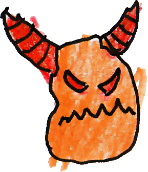

| field | value |
|---|---|
| displayName | Hornling Slime |
| color | #f06a24 |

## slime-many-eye

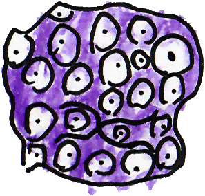

| field | value |
|---|---|
| displayName | Many-Eye Slime |
| color | #9b67d8 |

## slime-stonehead

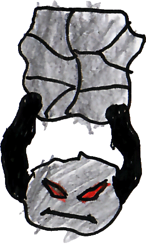

| field | value |
|---|---|
| displayName | Stonehead Slime |
| color | #8e8f95 |

## slime-sleeper

| field | value |
|---|---|
| displayName | Sleeper Slime |
| color | #9e7fd8 |

## slime-spark

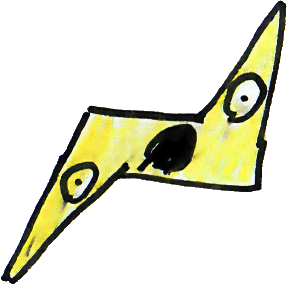

| field | value |
|---|---|
| displayName | Spark Slime |
| color | #f2e84a |

## slime-wraith

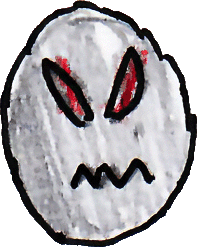

| field | value |
|---|---|
| displayName | Wraith Slime |
| color | #d9dce1 |

## slime-shell

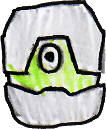

| field | value |
|---|---|
| displayName | Shell Slime |
| color | #a6e34a |

## slime-flame

| field | value |
|---|---|
| displayName | Flame Slime |
| color | #f6c06d |

## slime-mech-crab

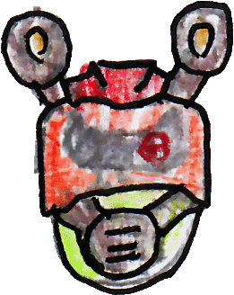

| field | value |
|---|---|
| displayName | Mech Crab Slime |
| color | #e85245 |

## slime-stack

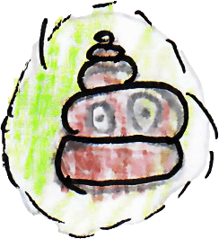

| field | value |
|---|---|
| displayName | Stack Slime |
| color | #cdeb84 |

## slime-trickster

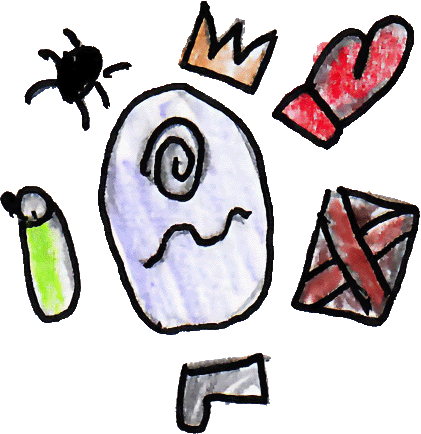

| field | value |
|---|---|
| displayName | Trickster Slime |
| color | #bdb4f4 |

## slime-bug

| field | value |
|---|---|
| displayName | Bug Slime |
| color | #8ee03a |

## slime-lifter

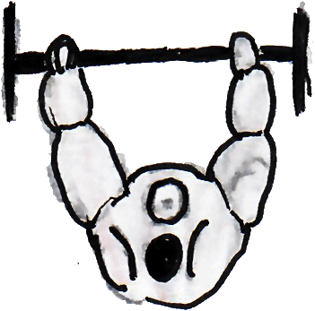

| field | value |
|---|---|
| displayName | Lifter Slime |
| color | #e6e8ea |

## slime-saw

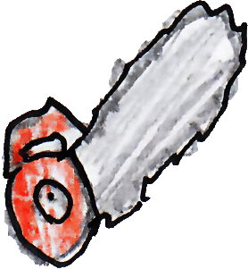

| field | value |
|---|---|
| displayName | Saw Slime |
| color | #f0523e |

## slime-drone

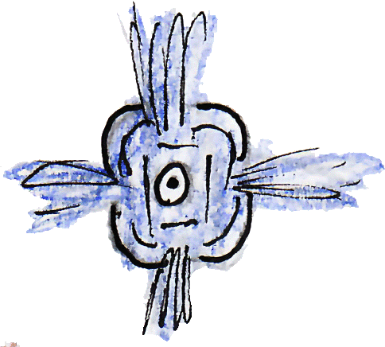

| field | value |
|---|---|
| displayName | Drone Slime |
| color | #afc4ea |

## slime-star

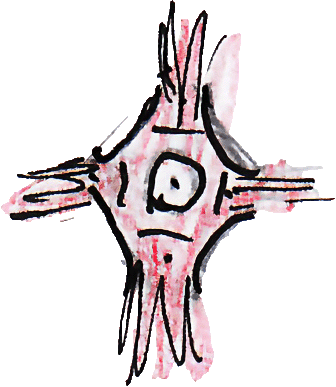

| field | value |
|---|---|
| displayName | Star Slime |
| color | #e8a8bc |

## slime-echo

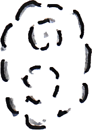

| field | value |
|---|---|
| displayName | Echo Slime |
| color | #4b5365 |

## slime-splitter

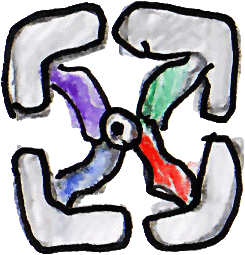

| field | value |
|---|---|
| displayName | Splitter Slime |
| color | #7bd1ae |

## slime-prince

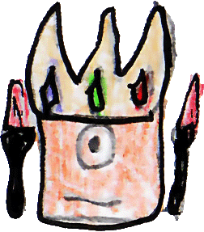

| field | value |
|---|---|
| displayName | Prince Slime |
| color | #f1b294 |

## slime-kingling

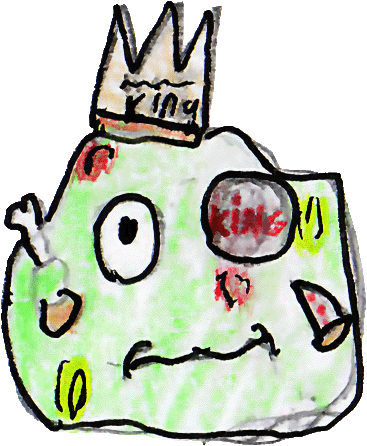

| field | value |
|---|---|
| displayName | Kingling Slime |
| color | #b7f3a6 |

## slime-fortress

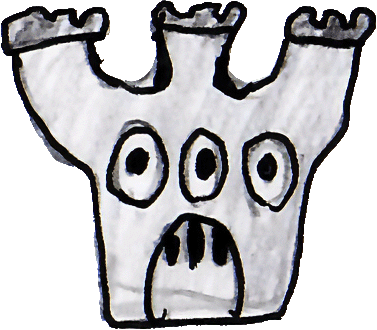

| field | value |
|---|---|
| displayName | Fortress Slime |
| color | #8f836e |

## slime-dasher

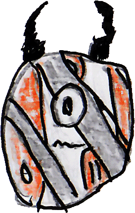

| field | value |
|---|---|
| displayName | Dasher Slime |
| color | #ef6a38 |

## slime-tadpole

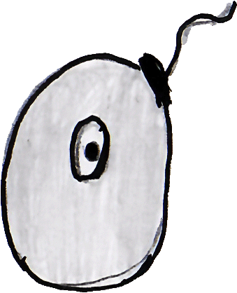

| field | value |
|---|---|
| displayName | Tadpole Slime |
| color | #d9dde2 |

## slime-door

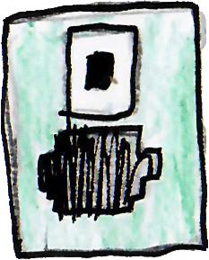

| field | value |
|---|---|
| displayName | Door Slime |
| color | #a7e5d2 |

## slime-mech

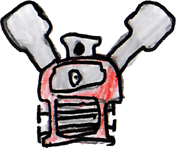

| field | value |
|---|---|
| displayName | Mech Slime |
| color | #ef7168 |

## slime-clamper

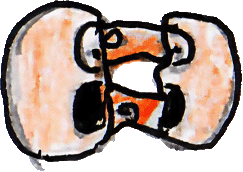

| field | value |
|---|---|
| displayName | Clamper Slime |
| color | #f2c0a6 |

## slime-candle

| field | value |
|---|---|
| displayName | Candle Slime |
| color | #a62922 |

## slime-obelisk

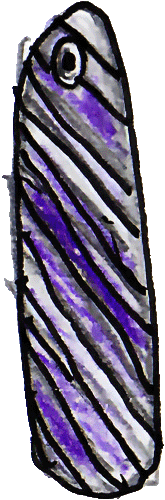

| field | value |
|---|---|
| displayName | Obelisk Slime |
| color | #5522a7 |

## slime-ninja

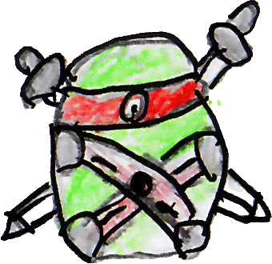

| field | value |
|---|---|
| displayName | Ninja Slime |
| color | #a4e982 |

# Balance

## Body

| id | radius | maxHp | behavior |
|---|---:|---:|---|
| slime-one-eye | 0.40 | 2 | chase |
| slime-hornling | 0.50 | 3 | chase |
| slime-many-eye | 0.60 | 4 | chase |
| slime-stonehead | 0.72 | 7 | chase |
| slime-sleeper | 0.45 | 3 | chase |
| slime-spark | 0.35 | 2 | chase |
| slime-wraith | 0.48 | 3 | chase |
| slime-shell | 0.65 | 6 | chase |
| slime-flame | 0.44 | 3 | chase |
| slime-mech-crab | 0.62 | 5 | chase |
| slime-stack | 0.58 | 4 | chase |
| slime-trickster | 0.52 | 4 | chase |
| slime-bug | 0.48 | 3 | chase |
| slime-lifter | 0.70 | 7 | chase |
| slime-saw | 0.55 | 4 | chase |
| slime-drone | 0.42 | 2 | chase |
| slime-star | 0.38 | 2 | chase |
| slime-echo | 0.36 | 2 | chase |
| slime-splitter | 0.56 | 4 | chase |
| slime-prince | 0.66 | 5 | chase |
| slime-kingling | 0.74 | 8 | chase |
| slime-fortress | 0.80 | 9 | chase |
| slime-dasher | 0.46 | 3 | chase |
| slime-tadpole | 0.34 | 2 | chase |
| slime-door | 0.76 | 8 | chase |
| slime-mech | 0.70 | 7 | chase |
| slime-clamper | 0.52 | 4 | chase |
| slime-candle | 0.46 | 3 | chase |
| slime-obelisk | 0.50 | 5 | chase |
| slime-ninja | 0.54 | 5 | chase |

## Movement

| id | maxSpeed |
|---|---:|
| slime-one-eye | 2.6 |
| slime-hornling | 2.5 |
| slime-many-eye | 2.2 |
| slime-stonehead | 1.5 |
| slime-sleeper | 1.0 |
| slime-spark | 2.8 |
| slime-wraith | 2.6 |
| slime-shell | 1.7 |
| slime-flame | 2.6 |
| slime-mech-crab | 2.0 |
| slime-stack | 2.2 |
| slime-trickster | 2.5 |
| slime-bug | 2.6 |
| slime-lifter | 1.6 |
| slime-saw | 2.5 |
| slime-drone | 2.8 |
| slime-star | 2.8 |
| slime-echo | 2.6 |
| slime-splitter | 2.4 |
| slime-prince | 2.2 |
| slime-kingling | 1.7 |
| slime-fortress | 1.2 |
| slime-dasher | 2.8 |
| slime-tadpole | 2.7 |
| slime-door | 1.1 |
| slime-mech | 1.8 |
| slime-clamper | 2.5 |
| slime-candle | 2.5 |
| slime-obelisk | 2.0 |
| slime-ninja | 2.6 |

## Contact damage

| id | contactDamage | contactCooldownMs |
|---|---:|---:|
| slime-one-eye | 1 | 800 |
| slime-hornling | 1 | 850 |
| slime-many-eye | 2 | 950 |
| slime-stonehead | 2 | 1000 |
| slime-sleeper | 1 | 1000 |
| slime-spark | 1 | 700 |
| slime-wraith | 1 | 800 |
| slime-shell | 2 | 1000 |
| slime-flame | 2 | 900 |
| slime-mech-crab | 2 | 950 |
| slime-stack | 1 | 900 |
| slime-trickster | 1 | 850 |
| slime-bug | 1 | 800 |
| slime-lifter | 3 | 1100 |
| slime-saw | 2 | 900 |
| slime-drone | 1 | 750 |
| slime-star | 1 | 700 |
| slime-echo | 1 | 750 |
| slime-splitter | 1 | 900 |
| slime-prince | 2 | 950 |
| slime-kingling | 3 | 1100 |
| slime-fortress | 3 | 1200 |
| slime-dasher | 2 | 850 |
| slime-tadpole | 1 | 750 |
| slime-door | 2 | 1100 |
| slime-mech | 3 | 1050 |
| slime-clamper | 2 | 900 |
| slime-candle | 1 | 850 |
| slime-obelisk | 2 | 1000 |
| slime-ninja | 3 | 950 |

## Knockback

| id | baseImpulse | velocityScale | durationMs |
|---|---:|---:|---:|
| slime-one-eye | 8 | 1.5 | 350 |
| slime-hornling | 5 | 1.0 | 280 |
| slime-many-eye | 5 | 1.0 | 280 |
| slime-stonehead | 3 | 0.5 | 220 |
| slime-sleeper | 3 | 0.5 | 220 |
| slime-spark | 8 | 1.5 | 350 |
| slime-wraith | 5 | 1.0 | 280 |
| slime-shell | 3 | 0.5 | 220 |
| slime-flame | 5 | 1.0 | 280 |
| slime-mech-crab | 5 | 1.0 | 280 |
| slime-stack | 5 | 1.0 | 280 |
| slime-trickster | 5 | 1.0 | 280 |
| slime-bug | 5 | 1.0 | 280 |
| slime-lifter | 3 | 0.5 | 220 |
| slime-saw | 5 | 1.0 | 280 |
| slime-drone | 8 | 1.5 | 350 |
| slime-star | 8 | 1.5 | 350 |
| slime-echo | 8 | 1.5 | 350 |
| slime-splitter | 5 | 1.0 | 280 |
| slime-prince | 5 | 1.0 | 280 |
| slime-kingling | 3 | 0.5 | 220 |
| slime-fortress | 3 | 0.5 | 220 |
| slime-dasher | 8 | 1.5 | 350 |
| slime-tadpole | 8 | 1.5 | 350 |
| slime-door | 3 | 0.5 | 220 |
| slime-mech | 3 | 0.5 | 220 |
| slime-clamper | 5 | 1.0 | 280 |
| slime-candle | 5 | 1.0 | 280 |
| slime-obelisk | 5 | 1.0 | 280 |
| slime-ninja | 8 | 1.5 | 350 |

## Drops

| id | dropArchetypeId | chance |
|---|---|---:|
| slime-one-eye | heal-orb | 0.18 |
| slime-one-eye | speed-up | 0.05 |
| slime-hornling | heal-orb | 0.20 |
| slime-hornling | size-up | 0.099 |
| slime-many-eye | multi-shot | 0.127 |
| slime-many-eye | pierce | 0.057 |
| slime-stonehead | heal-orb | 0.30 |
| slime-stonehead | size-up | 0.127 |
| slime-stonehead | fragment | 0.057 |
| slime-sleeper | heal-orb | 0.16 |
| slime-sleeper | magnet | 0.071 |
| slime-spark | speed-up | 0.155 |
| slime-spark | magnet | 0.085 |
| slime-spark | overdrive | 0.057 |
| slime-wraith | speed-up | 0.127 |
| slime-wraith | pierce | 0.113 |
| slime-shell | heal-orb | 0.32 |
| slime-shell | pierce | 0.141 |
| slime-flame | overdrive | 0.141 |
| slime-flame | fragment | 0.113 |
| slime-mech-crab | fragment | 0.169 |
| slime-mech-crab | pierce | 0.141 |
| slime-stack | multi-shot | 0.183 |
| slime-stack | heal-orb | 0.14 |
| slime-trickster | multi-shot | 0.141 |
| slime-trickster | speed-up | 0.113 |
| slime-bug | heal-orb | 0.18 |
| slime-bug | magnet | 0.099 |
| slime-lifter | heal-orb | 0.34 |
| slime-lifter | magnet | 0.141 |
| slime-saw | fragment | 0.169 |
| slime-saw | speed-up | 0.113 |
| slime-drone | speed-up | 0.183 |
| slime-drone | pierce | 0.099 |
| slime-star | speed-up | 0.155 |
| slime-star | multi-shot | 0.113 |
| slime-echo | magnet | 0.127 |
| slime-echo | speed-up | 0.099 |
| slime-splitter | multi-shot | 0.183 |
| slime-splitter | fragment | 0.113 |
| slime-prince | overdrive | 0.155 |
| slime-prince | multi-shot | 0.127 |
| slime-kingling | heal-orb | 0.32 |
| slime-kingling | overdrive | 0.155 |
| slime-fortress | heal-orb | 0.40 |
| slime-fortress | size-up | 0.141 |
| slime-dasher | speed-up | 0.155 |
| slime-dasher | overdrive | 0.113 |
| slime-tadpole | speed-up | 0.127 |
| slime-tadpole | magnet | 0.099 |
| slime-door | heal-orb | 0.34 |
| slime-door | pierce | 0.127 |
| slime-mech | fragment | 0.197 |
| slime-mech | pierce | 0.141 |
| slime-clamper | pierce | 0.155 |
| slime-clamper | magnet | 0.113 |
| slime-candle | overdrive | 0.155 |
| slime-candle | speed-up | 0.099 |
| slime-obelisk | fragment | 0.183 |
| slime-obelisk | overdrive | 0.127 |
| slime-ninja | overdrive | 0.155 |
| slime-ninja | pierce | 0.127 |

## Retaliation

| id | enabled | durationMs |
|---|---|---:|
| slime-one-eye | false | 0 |
| slime-hornling | false | 0 |
| slime-many-eye | false | 0 |
| slime-stonehead | false | 0 |
| slime-sleeper | false | 0 |
| slime-spark | false | 0 |
| slime-wraith | false | 0 |
| slime-shell | false | 0 |
| slime-flame | false | 0 |
| slime-mech-crab | false | 0 |
| slime-stack | false | 0 |
| slime-trickster | false | 0 |
| slime-bug | false | 0 |
| slime-lifter | false | 0 |
| slime-saw | false | 0 |
| slime-drone | false | 0 |
| slime-star | false | 0 |
| slime-echo | false | 0 |
| slime-splitter | false | 0 |
| slime-prince | false | 0 |
| slime-kingling | false | 0 |
| slime-fortress | false | 0 |
| slime-dasher | false | 0 |
| slime-tadpole | false | 0 |
| slime-door | false | 0 |
| slime-mech | false | 0 |
| slime-clamper | false | 0 |
| slime-candle | false | 0 |
| slime-obelisk | false | 0 |
| slime-ninja | false | 0 |

# Sound sets

## Members

| setId | slimes |
|---|---|
| default | slime-one-eye, slime-hornling, slime-many-eye, slime-stonehead, slime-sleeper, slime-spark, slime-wraith, slime-shell, slime-flame, slime-mech-crab, slime-stack, slime-trickster, slime-bug, slime-lifter, slime-saw, slime-drone, slime-star, slime-echo, slime-splitter, slime-prince, slime-kingling, slime-fortress, slime-dasher, slime-tadpole, slime-door, slime-mech, slime-clamper, slime-candle, slime-obelisk, slime-ninja |

## Hit

| setId | s1 | s2 | s3 | s4 |
|---|---|---|---|---|
| default | [slimes/hit-1](../public/sfx/slimes/slime-1.mp3) | [slimes/hit-2](../public/sfx/slimes/slime-2.mp3) | [slimes/hit-3](../public/sfx/slimes/slime-3.mp3) | [slimes/hit-4](../public/sfx/slimes/slime-4.mp3) |

## Death

| setId | s1 | s2 | s3 | s4 |
|---|---|---|---|---|
| default | [slimes/death-1](../public/sfx/slimes/slime-1.mp3) | [slimes/death-2](../public/sfx/slimes/slime-2.mp3) | [slimes/death-3](../public/sfx/slimes/slime-3.mp3) | [slimes/death-4](../public/sfx/slimes/slime-4.mp3) |

## Voice

| setId | s1 | s2 | s3 | s4 |
|---|---|---|---|---|
| default | [slimes/voice-1](../public/sfx/slimes/slime-1.mp3) | [slimes/voice-2](../public/sfx/slimes/slime-2.mp3) | [slimes/voice-3](../public/sfx/slimes/slime-3.mp3) | [slimes/voice-4](../public/sfx/slimes/slime-4.mp3) |
