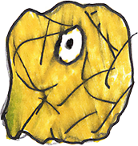
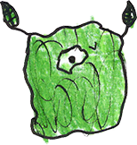
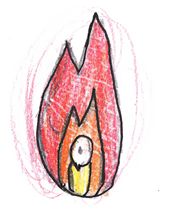

# Pets

## pet-01

| field | value |
|---|---|
| displayName | Sprout Buddy |
| quality | green |

## pet-02

| field | value |
|---|---|
| displayName | Clover Buddy |
| quality | green |

## pet-03

| field | value |
|---|---|
| displayName | Moss Buddy |
| quality | green |

## pet-04

| field | value |
|---|---|
| displayName | Mint Buddy |
| quality | green |

## pet-05

| field | value |
|---|---|
| displayName | Leaf Buddy |
| quality | green |

## pet-11

| field | value |
|---|---|
| displayName | Amethyst Buddy |
| quality | purple |

## pet-12

| field | value |
|---|---|
| displayName | Star Buddy |
| quality | purple |

## pet-13

| field | value |
|---|---|
| displayName | Dream Buddy |
| quality | purple |

## pet-14

| field | value |
|---|---|
| displayName | Mystic Buddy |
| quality | purple |

## pet-15

| field | value |
|---|---|
| displayName | Royal Buddy |
| quality | purple |

# Economy

| field | value |
|---|---:|
| xpPerDestroyedSlime | 1 |
| greenStandPrice | 25 |
| purpleStandPrice | 75 |
