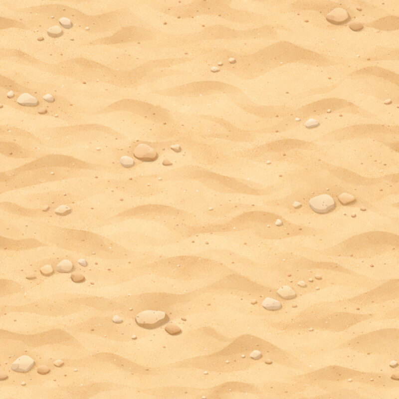

# Session

| field | value |
|---|---|
| displayName | Побег |
| description | Основной забег: пять тематических сетов слаймов, после каждого — свой босс. |
| visibleInMenu | true |
| order | 0 |
| arenaId | sandbox |
| playerId | hero-training |
| loadoutWeaponIds | pistol, shotgun, smg, sniper, laser, rock-thrower, grenade-launcher, bomb-placer, fireball-staff |
| selectedWeaponIndex | 0 |
| slimeFriendlyFire | false |
| aimAssistEnabled | false |
| aimAssistMaxAngleRadians | 0 |
| aimAssistMaxDistance | 0 |
| aimAssistStrength | 0 |
| winCondition | allEncountersComplete |
| lossCondition | playerDeath |

| backgroundId | image |
|---|---|
| set-1 |  |
| set-2 |  |
| set-3 |  |
| set-4 |  |
| set-5 |  |

# Encounters

## campaign-set-1-wave-1

| field | value |
|---|---|
| type | wave |
| backgroundId | set-1 |
| spawnKind | wave |
| spawnIntervalMs | 1500 |
| maxAlive | 4 |
| edgeMargin | 0.5 |
| zoneKind | shrinkLinear |
| zoneFromMargin | 0 |
| zoneToMargin | 2 |
| zoneDurationMs | 14000 |
| transitionKind | allEnemiesCleared |
| next | sequential |

| seq | archetypeId |
|---:|---|
| 1 | slime-one-eye |
| 2 | slime-one-eye |
| 3 | slime-sleeper |
| 4 | slime-one-eye |
| 5 | slime-hornling |
| 6 | slime-sleeper |

## campaign-set-1-wave-2

| field | value |
|---|---|
| type | wave |
| backgroundId | set-1 |
| spawnKind | wave |
| spawnIntervalMs | 1250 |
| maxAlive | 5 |
| edgeMargin | 0.5 |
| zoneKind | shrinkLinear |
| zoneFromMargin | 2 |
| zoneToMargin | 2.8 |
| zoneDurationMs | 16000 |
| transitionKind | allEnemiesCleared |
| next | sequential |

| seq | archetypeId |
|---:|---|
| 1 | slime-one-eye |
| 2 | slime-sleeper |
| 3 | slime-hornling |
| 4 | slime-spark |
| 5 | campaign-set-1-carrier-slime |
| 6 | slime-hornling |
| 7 | slime-spark |
| 8 | slime-sleeper |
| 9 | slime-hornling |

## campaign-set-1-wave-3

| field | value |
|---|---|
| type | wave |
| backgroundId | set-1 |
| spawnKind | wave |
| spawnIntervalMs | 1100 |
| maxAlive | 6 |
| edgeMargin | 0.5 |
| zoneKind | shrinkLinear |
| zoneFromMargin | 2.8 |
| zoneToMargin | 3.5 |
| zoneDurationMs | 18000 |
| transitionKind | allEnemiesCleared |
| next | sequential |

| seq | archetypeId |
|---:|---|
| 1 | slime-one-eye |
| 2 | slime-sleeper |
| 3 | slime-hornling |
| 4 | slime-spark |
| 5 | slime-many-eye |
| 6 | slime-hornling |
| 7 | slime-spark |
| 8 | slime-many-eye |
| 9 | slime-stonehead |
| 10 | slime-spark |
| 11 | slime-many-eye |
| 12 | slime-stonehead |

## campaign-set-1-pre-boss-break

| field | value |
|---|---|
| type | break |
| backgroundId | set-1 |
| spawnKind | empty |
| zoneKind | expandLinear |
| zoneFromMargin | 3.5 |
| zoneToMargin | 0 |
| zoneDurationMs | 3500 |
| transitionKind | timer |
| transitionDurationMs | 3500 |
| next | sequential |

## campaign-set-1-boss

| field | value |
|---|---|
| type | boss |
| backgroundId | set-1 |
| spawnKind | boss |
| bossArchetypeId | boss-gargoyle |
| bossSpawnPosition | top-center |
| bossEdgeMargin | 0.5 |
| zoneKind | disabled |
| transitionKind | allEnemiesCleared |
| next | sequential |

## campaign-set-1-after-boss-break

| field | value |
|---|---|
| type | break |
| backgroundId | set-1 |
| spawnKind | empty |
| zoneKind | disabled |
| transitionKind | timer |
| transitionDurationMs | 2500 |
| next | sequential |

## campaign-set-2-wave-1

| field | value |
|---|---|
| type | wave |
| backgroundId | set-2 |
| spawnKind | wave |
| spawnIntervalMs | 1400 |
| maxAlive | 5 |
| edgeMargin | 0.5 |
| zoneKind | shrinkLinear |
| zoneFromMargin | 0 |
| zoneToMargin | 2 |
| zoneDurationMs | 15000 |
| transitionKind | allEnemiesCleared |
| next | sequential |

| seq | archetypeId |
|---:|---|
| 1 | slime-trickster |
| 2 | slime-wraith |
| 3 | slime-trickster |
| 4 | slime-shell |
| 5 | slime-wraith |
| 6 | slime-trickster |
| 7 | slime-shell |

## campaign-set-2-wave-2

| field | value |
|---|---|
| type | wave |
| backgroundId | set-2 |
| spawnKind | wave |
| spawnIntervalMs | 1150 |
| maxAlive | 6 |
| edgeMargin | 0.5 |
| zoneKind | shrinkLinear |
| zoneFromMargin | 2 |
| zoneToMargin | 2.8 |
| zoneDurationMs | 17000 |
| transitionKind | allEnemiesCleared |
| next | sequential |

| seq | archetypeId |
|---:|---|
| 1 | slime-trickster |
| 2 | slime-wraith |
| 3 | slime-shell |
| 4 | slime-stack |
| 5 | campaign-set-2-carrier-slime |
| 6 | slime-shell |
| 7 | slime-stack |
| 8 | slime-trickster |
| 9 | slime-mech-crab |
| 10 | slime-stack |

## campaign-set-2-wave-3

| field | value |
|---|---|
| type | wave |
| backgroundId | set-2 |
| spawnKind | wave |
| spawnIntervalMs | 1000 |
| maxAlive | 6 |
| edgeMargin | 0.5 |
| zoneKind | shrinkLinear |
| zoneFromMargin | 2.8 |
| zoneToMargin | 3.5 |
| zoneDurationMs | 19000 |
| transitionKind | allEnemiesCleared |
| next | sequential |

| seq | archetypeId |
|---:|---|
| 1 | slime-trickster |
| 2 | slime-wraith |
| 3 | slime-shell |
| 4 | slime-stack |
| 5 | slime-mech-crab |
| 6 | slime-shell |
| 7 | slime-stack |
| 8 | slime-mech-crab |
| 9 | slime-flame |
| 10 | slime-wraith |
| 11 | slime-stack |
| 12 | slime-mech-crab |
| 13 | slime-flame |

## campaign-set-2-pre-boss-break

| field | value |
|---|---|
| type | break |
| backgroundId | set-2 |
| spawnKind | empty |
| zoneKind | expandLinear |
| zoneFromMargin | 3.5 |
| zoneToMargin | 0 |
| zoneDurationMs | 3500 |
| transitionKind | timer |
| transitionDurationMs | 3500 |
| next | sequential |

## campaign-set-2-boss

| field | value |
|---|---|
| type | boss |
| backgroundId | set-2 |
| spawnKind | boss |
| bossArchetypeId | boss-saw-cyclops |
| bossSpawnPosition | top-center |
| bossEdgeMargin | 0.5 |
| zoneKind | disabled |
| transitionKind | allEnemiesCleared |
| next | sequential |

## campaign-set-2-after-boss-break

| field | value |
|---|---|
| type | break |
| backgroundId | set-2 |
| spawnKind | empty |
| zoneKind | disabled |
| transitionKind | timer |
| transitionDurationMs | 2500 |
| next | sequential |

## campaign-set-3-wave-1

| field | value |
|---|---|
| type | wave |
| backgroundId | set-3 |
| spawnKind | wave |
| spawnIntervalMs | 1300 |
| maxAlive | 5 |
| edgeMargin | 0.5 |
| zoneKind | shrinkLinear |
| zoneFromMargin | 0 |
| zoneToMargin | 2 |
| zoneDurationMs | 16000 |
| transitionKind | allEnemiesCleared |
| next | sequential |

| seq | archetypeId |
|---:|---|
| 1 | slime-echo |
| 2 | slime-bug |
| 3 | slime-echo |
| 4 | slime-star |
| 5 | slime-bug |
| 6 | slime-echo |
| 7 | slime-star |
| 8 | slime-bug |

## campaign-set-3-wave-2

| field | value |
|---|---|
| type | wave |
| backgroundId | set-3 |
| spawnKind | wave |
| spawnIntervalMs | 1050 |
| maxAlive | 6 |
| edgeMargin | 0.5 |
| zoneKind | shrinkLinear |
| zoneFromMargin | 2 |
| zoneToMargin | 2.8 |
| zoneDurationMs | 18000 |
| transitionKind | allEnemiesCleared |
| next | sequential |

| seq | archetypeId |
|---:|---|
| 1 | slime-echo |
| 2 | slime-bug |
| 3 | slime-star |
| 4 | slime-lifter |
| 5 | campaign-set-3-carrier-slime |
| 6 | slime-star |
| 7 | slime-lifter |
| 8 | slime-echo |
| 9 | slime-drone |
| 10 | slime-star |
| 11 | slime-lifter |

## campaign-set-3-wave-3

| field | value |
|---|---|
| type | wave |
| backgroundId | set-3 |
| spawnKind | wave |
| spawnIntervalMs | 900 |
| maxAlive | 7 |
| edgeMargin | 0.5 |
| zoneKind | shrinkLinear |
| zoneFromMargin | 2.8 |
| zoneToMargin | 3.5 |
| zoneDurationMs | 20000 |
| transitionKind | allEnemiesCleared |
| next | sequential |

| seq | archetypeId |
|---:|---|
| 1 | slime-echo |
| 2 | slime-bug |
| 3 | slime-star |
| 4 | slime-lifter |
| 5 | slime-drone |
| 6 | slime-star |
| 7 | slime-lifter |
| 8 | slime-drone |
| 9 | slime-saw |
| 10 | slime-bug |
| 11 | slime-star |
| 12 | slime-lifter |
| 13 | slime-drone |
| 14 | slime-saw |

## campaign-set-3-pre-boss-break

| field | value |
|---|---|
| type | break |
| backgroundId | set-3 |
| spawnKind | empty |
| zoneKind | expandLinear |
| zoneFromMargin | 3.5 |
| zoneToMargin | 0 |
| zoneDurationMs | 3500 |
| transitionKind | timer |
| transitionDurationMs | 3500 |
| next | sequential |

## campaign-set-3-boss

| field | value |
|---|---|
| type | boss |
| backgroundId | set-3 |
| spawnKind | boss |
| bossArchetypeId | boss-scrap-king |
| bossSpawnPosition | top-center |
| bossEdgeMargin | 0.5 |
| zoneKind | disabled |
| transitionKind | allEnemiesCleared |
| next | sequential |

## campaign-set-3-after-boss-break

| field | value |
|---|---|
| type | break |
| backgroundId | set-3 |
| spawnKind | empty |
| zoneKind | disabled |
| transitionKind | timer |
| transitionDurationMs | 2500 |
| next | sequential |

## campaign-set-4-wave-1

| field | value |
|---|---|
| type | wave |
| backgroundId | set-4 |
| spawnKind | wave |
| spawnIntervalMs | 1200 |
| maxAlive | 6 |
| edgeMargin | 0.5 |
| zoneKind | shrinkLinear |
| zoneFromMargin | 0 |
| zoneToMargin | 2 |
| zoneDurationMs | 17000 |
| transitionKind | allEnemiesCleared |
| next | sequential |

| seq | archetypeId |
|---:|---|
| 1 | slime-tadpole |
| 2 | slime-fortress |
| 3 | slime-tadpole |
| 4 | slime-splitter |
| 5 | slime-fortress |
| 6 | slime-tadpole |
| 7 | slime-splitter |
| 8 | slime-fortress |

## campaign-set-4-wave-2

| field | value |
|---|---|
| type | wave |
| backgroundId | set-4 |
| spawnKind | wave |
| spawnIntervalMs | 950 |
| maxAlive | 7 |
| edgeMargin | 0.5 |
| zoneKind | shrinkLinear |
| zoneFromMargin | 2 |
| zoneToMargin | 2.8 |
| zoneDurationMs | 19000 |
| transitionKind | allEnemiesCleared |
| next | sequential |

| seq | archetypeId |
|---:|---|
| 1 | slime-tadpole |
| 2 | slime-fortress |
| 3 | slime-splitter |
| 4 | slime-prince |
| 5 | campaign-set-4-carrier-slime |
| 6 | slime-splitter |
| 7 | slime-prince |
| 8 | slime-tadpole |
| 9 | slime-dasher |
| 10 | slime-splitter |
| 11 | slime-prince |
| 12 | slime-dasher |

## campaign-set-4-wave-3

| field | value |
|---|---|
| type | wave |
| backgroundId | set-4 |
| spawnKind | wave |
| spawnIntervalMs | 800 |
| maxAlive | 8 |
| edgeMargin | 0.5 |
| zoneKind | shrinkLinear |
| zoneFromMargin | 2.8 |
| zoneToMargin | 3.5 |
| zoneDurationMs | 21000 |
| transitionKind | allEnemiesCleared |
| next | sequential |

| seq | archetypeId |
|---:|---|
| 1 | slime-tadpole |
| 2 | slime-fortress |
| 3 | slime-splitter |
| 4 | slime-prince |
| 5 | slime-dasher |
| 6 | slime-splitter |
| 7 | slime-prince |
| 8 | slime-dasher |
| 9 | slime-kingling |
| 10 | slime-fortress |
| 11 | slime-splitter |
| 12 | slime-prince |
| 13 | slime-dasher |
| 14 | slime-kingling |
| 15 | slime-kingling |

## campaign-set-4-pre-boss-break

| field | value |
|---|---|
| type | break |
| backgroundId | set-4 |
| spawnKind | empty |
| zoneKind | expandLinear |
| zoneFromMargin | 3.5 |
| zoneToMargin | 0 |
| zoneDurationMs | 3500 |
| transitionKind | timer |
| transitionDurationMs | 3500 |
| next | sequential |

## campaign-set-4-boss

| field | value |
|---|---|
| type | boss |
| backgroundId | set-4 |
| spawnKind | boss |
| bossArchetypeId | boss-tower-sentinel |
| bossSpawnPosition | top-center |
| bossEdgeMargin | 0.5 |
| zoneKind | disabled |
| transitionKind | allEnemiesCleared |
| next | sequential |

## campaign-set-4-after-boss-break

| field | value |
|---|---|
| type | break |
| backgroundId | set-4 |
| spawnKind | empty |
| zoneKind | disabled |
| transitionKind | timer |
| transitionDurationMs | 2500 |
| next | sequential |

## campaign-set-5-wave-1

| field | value |
|---|---|
| type | wave |
| backgroundId | set-5 |
| spawnKind | wave |
| spawnIntervalMs | 1100 |
| maxAlive | 7 |
| edgeMargin | 0.5 |
| zoneKind | shrinkLinear |
| zoneFromMargin | 0 |
| zoneToMargin | 2 |
| zoneDurationMs | 18000 |
| transitionKind | allEnemiesCleared |
| next | sequential |

| seq | archetypeId |
|---:|---|
| 1 | slime-door |
| 2 | slime-candle |
| 3 | slime-door |
| 4 | slime-mech |
| 5 | slime-candle |
| 6 | slime-door |
| 7 | slime-mech |
| 8 | slime-candle |
| 9 | slime-door |

## campaign-set-5-wave-2

| field | value |
|---|---|
| type | wave |
| backgroundId | set-5 |
| spawnKind | wave |
| spawnIntervalMs | 850 |
| maxAlive | 8 |
| edgeMargin | 0.5 |
| zoneKind | shrinkLinear |
| zoneFromMargin | 2 |
| zoneToMargin | 2.8 |
| zoneDurationMs | 20000 |
| transitionKind | allEnemiesCleared |
| next | sequential |

| seq | archetypeId |
|---:|---|
| 1 | slime-door |
| 2 | slime-candle |
| 3 | slime-mech |
| 4 | slime-clamper |
| 5 | campaign-set-5-carrier-slime |
| 6 | slime-mech |
| 7 | slime-clamper |
| 8 | slime-door |
| 9 | slime-ninja |
| 10 | slime-mech |
| 11 | slime-clamper |
| 12 | slime-ninja |
| 13 | slime-candle |

## campaign-set-5-wave-3

| field | value |
|---|---|
| type | wave |
| backgroundId | set-5 |
| spawnKind | wave |
| spawnIntervalMs | 700 |
| maxAlive | 9 |
| edgeMargin | 0.5 |
| zoneKind | shrinkLinear |
| zoneFromMargin | 2.8 |
| zoneToMargin | 3.5 |
| zoneDurationMs | 22000 |
| transitionKind | allEnemiesCleared |
| next | sequential |

| seq | archetypeId |
|---:|---|
| 1 | slime-door |
| 2 | slime-candle |
| 3 | slime-mech |
| 4 | slime-clamper |
| 5 | slime-ninja |
| 6 | slime-mech |
| 7 | slime-clamper |
| 8 | slime-ninja |
| 9 | slime-obelisk |
| 10 | slime-candle |
| 11 | slime-mech |
| 12 | slime-clamper |
| 13 | slime-ninja |
| 14 | slime-obelisk |
| 15 | slime-obelisk |
| 16 | slime-ninja |

## campaign-set-5-pre-boss-break

| field | value |
|---|---|
| type | break |
| backgroundId | set-5 |
| spawnKind | empty |
| zoneKind | expandLinear |
| zoneFromMargin | 3.5 |
| zoneToMargin | 0 |
| zoneDurationMs | 3500 |
| transitionKind | timer |
| transitionDurationMs | 3500 |
| next | sequential |

## campaign-set-5-boss

| field | value |
|---|---|
| type | boss |
| backgroundId | set-5 |
| spawnKind | boss |
| bossArchetypeId | boss-bubble-hog |
| bossSpawnPosition | top-center |
| bossEdgeMargin | 0.5 |
| zoneKind | disabled |
| transitionKind | allEnemiesCleared |
| next | sequential |
