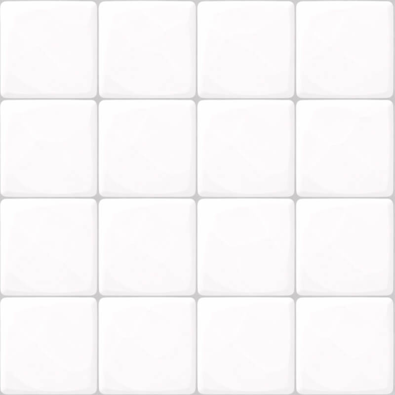

# Session

| field | value |
|---|---|
| displayName | Combat Modifiers Demo |
| description | Проверочная арена для puddles, statuses, proximity mines, carrier drops, magnet pickup, retaliation and aim assist. |
| visibleInMenu | false |
| order | 1 |
| arenaId | sandbox |
| playerId | hero-sandbox |
| loadoutWeaponIds | demo-hazard-grenade, demo-proximity-mine, pistol |
| selectedWeaponIndex | 0 |
| slimeFriendlyFire | true |
| aimAssistEnabled | true |
| aimAssistMaxAngleRadians | 0.35 |
| aimAssistMaxDistance | 8 |
| aimAssistStrength | 0.65 |
| winCondition | none |
| lossCondition | none |

| backgroundId | image |
|---|---|
| sandbox |  |

# Encounters

## combat-modifiers-demo-encounter

| field | value |
|---|---|
| type | sandbox |
| backgroundId | sandbox |
| spawnKind | static |
| zoneKind | disabled |
| transitionKind | never |
| next | sequential |

| seq | archetypeId | x | y |
|---:|---|---:|---:|
| 1 | slime-star | 4 | 1.5 |
| 2 | slime-saw | 5 | -1 |
| 3 | slime-saw | 7 | -1 |
| 4 | slime-bug | 6 | 2.5 |

| seq | guaranteedDrops | dropTable | retaliationEnabled | retaliationDurationMs | loadoutWeaponIds | selectedWeaponIndex |
|---:|---|---|---|---:|---|---|
| 1 | magnet, heal-orb | empty | none | none | none | none |
| 2 | none | heal-orb:0.20 | true | 2500 | none | none |
| 3 | none | heal-orb:0.20 | true | 2500 | none | none |
