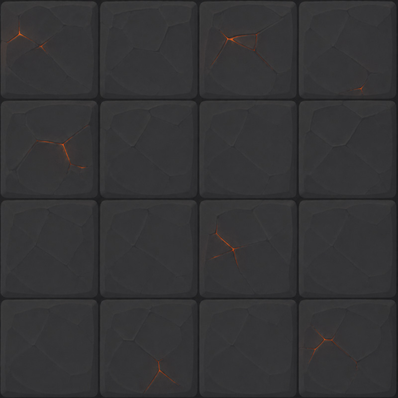

# Session

| field | value |
|---|---|
| displayName | Dungeon |
| description | Endless authored wave loop for quick repeatable survival runs. |
| musicSampleId | music/100-waves |
| visibleInMenu | false |
| order | 1 |
| arenaWidth | 32 |
| arenaHeight | 18 |
| playerId | hero-training |
| loadoutWeaponIds | pistol, shotgun, smg, sniper, grenade-launcher, bomb-placer |
| selectedWeaponIndex | 0 |
| slimeFriendlyFire | true |
| aimAssistEnabled | false |
| aimAssistMaxAngleRadians | 0 |
| aimAssistMaxDistance | 0 |
| aimAssistStrength | 0 |
| winCondition | dungeon |
| lossCondition | playerDeath |

| backgroundId | image |
|---|---|
| cellar |  |
| tunnels |  |
| vault |  |

# Encounters

## dungeon-wave-1

| field | value |
|---|---|
| type | wave |
| backgroundId | cellar |
| introDurationMs | 1800 |
| name | Cellar Rush |
| text | none |
| spawnKind | wave |
| spawnIntervalMs | 1150 |
| maxAlive | 5 |
| edgeMargin | 0.5 |
| zoneKind | shrinkLinear |
| zoneFromMargin | 0 |
| zoneToMargin | 2.2 |
| zoneDurationMs | 17000 |
| transitionKind | allEnemiesCleared |
| next | sequential |

| seq | archetypeId |
|---:|---|
| 1 | slime-one-eye |
| 2 | slime-hornling |
| 3 | slime-spark |
| 4 | slime-one-eye |
| 5 | slime-shell |
| 6 | slime-hornling |
| 7 | slime-spark |
| 8 | slime-stonehead |

| seq | guaranteedDrops | dropTable | retaliationEnabled | retaliationDurationMs | loadoutWeaponIds | selectedWeaponIndex |
|---:|---|---|---|---:|---|---|
| 8 | none | none | none | none | rock-thrower | 0 |

## dungeon-reset-1

| field | value |
|---|---|
| type | break |
| backgroundId | cellar |
| introDurationMs | none |
| name | none |
| text | Deeper. |
| spawnKind | empty |
| zoneKind | expandLinear |
| zoneFromMargin | 2.2 |
| zoneToMargin | 0 |
| zoneDurationMs | 2400 |
| transitionKind | timer |
| transitionDurationMs | 2400 |
| next | sequential |

## dungeon-wave-2

| field | value |
|---|---|
| type | wave |
| backgroundId | tunnels |
| introDurationMs | 1800 |
| name | Tunnel Teeth |
| text | none |
| spawnKind | wave |
| spawnIntervalMs | 1000 |
| maxAlive | 6 |
| edgeMargin | 0.5 |
| zoneKind | shrinkLinear |
| zoneFromMargin | 0 |
| zoneToMargin | 2.8 |
| zoneDurationMs | 19000 |
| transitionKind | allEnemiesCleared |
| next | sequential |

| seq | archetypeId |
|---:|---|
| 1 | slime-wraith |
| 2 | slime-trickster |
| 3 | slime-shell |
| 4 | slime-wraith |
| 5 | slime-spark |
| 6 | slime-mech-crab |
| 7 | slime-trickster |
| 8 | slime-many-eye |
| 9 | slime-stonehead |
| 10 | slime-mech-crab |

| seq | guaranteedDrops | dropTable | retaliationEnabled | retaliationDurationMs | loadoutWeaponIds | selectedWeaponIndex |
|---:|---|---|---|---:|---|---|
| 9 | none | none | none | none | rock-thrower | 0 |

## dungeon-reset-2

| field | value |
|---|---|
| type | break |
| backgroundId | tunnels |
| introDurationMs | none |
| name | none |
| text | Keep moving. |
| spawnKind | empty |
| zoneKind | expandLinear |
| zoneFromMargin | 2.8 |
| zoneToMargin | 0 |
| zoneDurationMs | 2600 |
| transitionKind | timer |
| transitionDurationMs | 2600 |
| next | sequential |

## dungeon-wave-3

| field | value |
|---|---|
| type | wave |
| backgroundId | vault |
| introDurationMs | 1800 |
| name | Vault Crush |
| text | none |
| spawnKind | wave |
| spawnIntervalMs | 900 |
| maxAlive | 7 |
| edgeMargin | 0.5 |
| zoneKind | shrinkLinear |
| zoneFromMargin | 0 |
| zoneToMargin | 3.4 |
| zoneDurationMs | 21000 |
| transitionKind | allEnemiesCleared |
| next | sequential |

| seq | archetypeId |
|---:|---|
| 1 | slime-stonehead |
| 2 | slime-flame |
| 3 | slime-spark |
| 4 | slime-wraith |
| 5 | slime-shell |
| 6 | slime-trickster |
| 7 | slime-many-eye |
| 8 | slime-mech-crab |
| 9 | slime-stonehead |
| 10 | slime-flame |
| 11 | slime-wraith |
| 12 | slime-mech-crab |

| seq | guaranteedDrops | dropTable | retaliationEnabled | retaliationDurationMs | loadoutWeaponIds | selectedWeaponIndex |
|---:|---|---|---|---:|---|---|
| 1 | none | none | none | none | rock-thrower | 0 |
| 9 | none | none | none | none | rock-thrower | 0 |

## dungeon-reset-3

| field | value |
|---|---|
| type | break |
| backgroundId | vault |
| introDurationMs | none |
| name | none |
| text | The dungeon loops. You do not. |
| spawnKind | empty |
| zoneKind | expandLinear |
| zoneFromMargin | 3.4 |
| zoneToMargin | 0 |
| zoneDurationMs | 3000 |
| transitionKind | timer |
| transitionDurationMs | 3000 |
| next | sequential |
