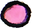
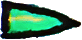
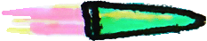
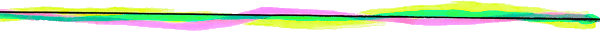
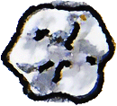
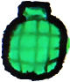
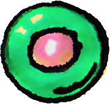
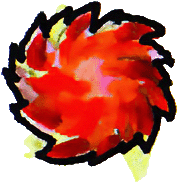
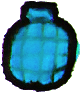
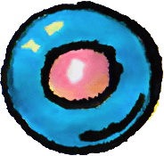

# Weapons

## pistol

[weapons/pistol](../public/sfx/weapons/pistol.mp3)

| field | value |
|---|---|
| displayName | Pistol |

## shotgun

[weapons/shotgun](../public/sfx/weapons/shotgun.mp3)

| field | value |
|---|---|
| displayName | Shotgun |

## smg

[weapons/smg](../public/sfx/weapons/smg.mp3)

| field | value |
|---|---|
| displayName | SMG |

## sniper

[weapons/sniper](../public/sfx/weapons/sniper.mp3)

| field | value |
|---|---|
| displayName | Sniper |

## laser

[weapons/laser](../public/sfx/weapons/laser.mp3)

| field | value |
|---|---|
| displayName | Laser |

## rock-thrower

[weapons/pistol](../public/sfx/weapons/pistol.mp3)

| field | value |
|---|---|
| displayName | Rock Thrower |

## grenade-launcher

[weapons/shotgun](../public/sfx/weapons/shotgun.mp3)

| field | value |
|---|---|
| displayName | Grenade Launcher |

## bomb-placer

[weapons/shotgun](../public/sfx/weapons/shotgun.mp3)

| field | value |
|---|---|
| displayName | Bomb Placer |

## fireball-staff

[weapons/laser](../public/sfx/weapons/laser.mp3)

| field | value |
|---|---|
| displayName | Fireball Staff |

## demo-hazard-grenade

[weapons/shotgun](../public/sfx/weapons/shotgun.mp3)

| field | value |
|---|---|
| displayName | Demo Hazard Grenade |

## demo-proximity-mine

[weapons/shotgun](../public/sfx/weapons/shotgun.mp3)

| field | value |
|---|---|
| displayName | Demo Proximity Mine |

# Balance

## Cooldown

| id | cooldownMs |
|---|---:|
| pistol | 250 |
| shotgun | 900 |
| smg | 150 |
| sniper | 1200 |
| laser | 140 |
| rock-thrower | 700 |
| grenade-launcher | 1100 |
| bomb-placer | 1600 |
| fireball-staff | 850 |
| demo-hazard-grenade | 650 |
| demo-proximity-mine | 700 |

## Fire Pattern

| id | kind | count | spreadRadians | directionsRadians |
|---|---|---:|---:|---|
| pistol | single | 1 | 0 | none |
| shotgun | single | 5 | 0.55 | none |
| smg | single | 1 | 0 | none |
| sniper | single | 1 | 0 | none |
| laser | single | 1 | 0 | none |
| rock-thrower | single | 1 | 0 | none |
| grenade-launcher | single | 1 | 0 | none |
| bomb-placer | place | 0 | 0 | none |
| fireball-staff | multiDirection | 0 | 0 | 0, 1.5707963268, 3.1415926536, 4.7123889804 |
| demo-hazard-grenade | single | 1 | 0 | none |
| demo-proximity-mine | place | 0 | 0 | none |

## Projectile Motion

| id | kind | speed | range | flightMs |
|---|---|---:|---:|---:|
| pistol | linear | 12 | none | none |
| shotgun | linear | 14 | none | none |
| smg | linear | 22 | none | none |
| sniper | linear | 28 | none | none |
| laser | linear | 27 | none | none |
| rock-thrower | arc | 8 | 5 | 550 |
| grenade-launcher | arc | 7 | 6 | 700 |
| bomb-placer | placed | none | none | none |
| fireball-staff | linear | 9 | none | none |
| demo-hazard-grenade | arc | 7 | 5 | 550 |
| demo-proximity-mine | placed | none | none | none |

## Projectile Lifecycle

| id | hitRadius | ttlMs | groundOnImpact | groundedLifetimeMs |
|---|---:|---:|---|---:|
| pistol | 0.1 | 2000 | false | none |
| shotgun | 0.18 | 500 | false | none |
| smg | 0.08 | 1600 | false | none |
| sniper | 0.08 | 2400 | false | none |
| laser | 0.05 | 900 | false | none |
| rock-thrower | 0.18 | 1300 | true | 350 |
| grenade-launcher | 0.22 | 2200 | true | 1200 |
| bomb-placer | 0.25 | 2200 | true | 1800 |
| fireball-staff | 0.2 | 1400 | false | none |
| demo-hazard-grenade | 0.22 | 2400 | true | 1600 |
| demo-proximity-mine | 0.25 | 10000 | true | 10000 |

## Detonation Trigger

| id | kind | radius | armDelayMs |
|---|---|---:|---:|
| pistol | none | 0 | 0 |
| shotgun | none | 0 | 0 |
| smg | none | 0 | 0 |
| sniper | none | 0 | 0 |
| laser | none | 0 | 0 |
| rock-thrower | none | 0 | 0 |
| grenade-launcher | timer | 0 | 0 |
| bomb-placer | timer | 0 | 0 |
| fireball-staff | none | 0 | 0 |
| demo-hazard-grenade | timer | 0 | 0 |
| demo-proximity-mine | timerOrProximity | 2.2 | 250 |

## Projectile Impact

| id | impactDamage | knockbackImpulse | pierceCount |
|---|---:|---:|---:|
| pistol | 1 | 5 | 0 |
| shotgun | 2 | 12 | 0 |
| smg | 1 | 3 | 0 |
| sniper | 6 | 9 | 1 |
| laser | 1 | 2 | 3 |
| rock-thrower | 3 | 12 | 0 |
| grenade-launcher | 1 | 6 | 0 |
| bomb-placer | 0 | 0 | 0 |
| fireball-staff | 2 | 5 | 0 |
| demo-hazard-grenade | 1 | 6 | 0 |
| demo-proximity-mine | 0 | 0 | 0 |

## Explosion

| id | delayMs | radius | damage | knockbackImpulse |
|---|---:|---:|---:|---:|
| pistol | none | 0 | 0 | 0 |
| shotgun | none | 0 | 0 | 0 |
| smg | none | 0 | 0 | 0 |
| sniper | none | 0 | 0 | 0 |
| laser | none | 0 | 0 | 0 |
| rock-thrower | none | 0 | 0 | 0 |
| grenade-launcher | 1000 | 1.8 | 4 | 16 |
| bomb-placer | 1800 | 2.2 | 5 | 20 |
| fireball-staff | none | 0 | 0 | 0 |
| demo-hazard-grenade | 150 | 1.8 | 2 | 10 |
| demo-proximity-mine | 4500 | 2.2 | 4 | 16 |

## Explosion Fragments

| id | fragmentWeaponId | count | spreadRadians |
|---|---|---:|---:|
| pistol | none | 0 | 0 |
| shotgun | none | 0 | 0 |
| smg | none | 0 | 0 |
| sniper | none | 0 | 0 |
| laser | none | 0 | 0 |
| rock-thrower | none | 0 | 0 |
| grenade-launcher | none | 0 | 0 |
| bomb-placer | none | 0 | 0 |
| fireball-staff | none | 0 | 0 |
| demo-hazard-grenade | none | 0 | 0 |
| demo-proximity-mine | none | 0 | 0 |

## Explosion Field Effect

| id | fieldArchetypeId | radius | durationMs | applyEveryMs | damage | statusKind | statusValue | tickEveryMs | statusDurationMs |
|---|---|---:|---:|---:|---:|---|---:|---:|---:|
| pistol | none | 0 | 0 | 0 | none | none | 0 | 0 | 0 |
| shotgun | none | 0 | 0 | 0 | none | none | 0 | 0 | 0 |
| smg | none | 0 | 0 | 0 | none | none | 0 | 0 | 0 |
| sniper | none | 0 | 0 | 0 | none | none | 0 | 0 | 0 |
| laser | none | 0 | 0 | 0 | none | none | 0 | 0 | 0 |
| rock-thrower | none | 0 | 0 | 0 | none | none | 0 | 0 | 0 |
| grenade-launcher | none | 0 | 0 | 0 | none | none | 0 | 0 | 0 |
| bomb-placer | none | 0 | 0 | 0 | none | none | 0 | 0 | 0 |
| fireball-staff | none | 0 | 0 | 0 | none | none | 0 | 0 | 0 |
| demo-hazard-grenade | demo-burning-puddle | 1.6 | 2200 | 450 | 1 | burn | 1 | 600 | 1800 |
| demo-proximity-mine | demo-slow-field | 1.9 | 6000 | 300 | none | slow | 0.45 | 0 | 1200 |

## Explosion Status

| id | statusKind | statusValue | tickEveryMs | statusDurationMs |
|---|---|---:|---:|---:|
| pistol | none | 0 | 0 | 0 |
| shotgun | none | 0 | 0 | 0 |
| smg | none | 0 | 0 | 0 |
| sniper | none | 0 | 0 | 0 |
| laser | none | 0 | 0 | 0 |
| rock-thrower | none | 0 | 0 | 0 |
| grenade-launcher | none | 0 | 0 | 0 |
| bomb-placer | none | 0 | 0 | 0 |
| fireball-staff | none | 0 | 0 | 0 |
| demo-hazard-grenade | slow | 0.55 | 0 | 1600 |
| demo-proximity-mine | poison | 1 | 700 | 1800 |

## Projectile Visual

| id | spinRadiansPerSec | rotateWhileFlying | pulseWhenGrounded | explosionRadiusIndicator |
|---|---:|---|---|---|
| pistol | 0 | true | false | false |
| shotgun | 0 | true | false | false |
| smg | 0 | true | false | false |
| sniper | 0 | true | false | false |
| laser | 0 | true | false | false |
| rock-thrower | 8 | true | false | false |
| grenade-launcher | 6 | true | true | true |
| bomb-placer | 0 | false | true | true |
| fireball-staff | 4 | true | false | false |
| demo-hazard-grenade | 6 | true | true | true |
| demo-proximity-mine | 0 | false | true | true |
